

    
    <h2 align="center">Full-Stack Web Application for Supply Chain Management</h2>

### Overview

This project is a full-stack web application that enhances supply chain management through the use of machine learning models. It integrates Python and its machine learning libraries for backend processing, and employs Flask, along with HTML, CSS, and JavaScript for the frontend. This combination provides an intuitive interface for user interaction and facilitates data-driven decision-making in supply chain operations.

### Features

#### Front End

- **Interactive Interface**: Developed with HTML, CSS, and JavaScript for effective user engagement.
- **Structure and Navigation**: Segmented into multiple pages for streamlined user interaction.
  - **Index Page**: Displays dashboards and visualizations for Business Intelligence.
    
 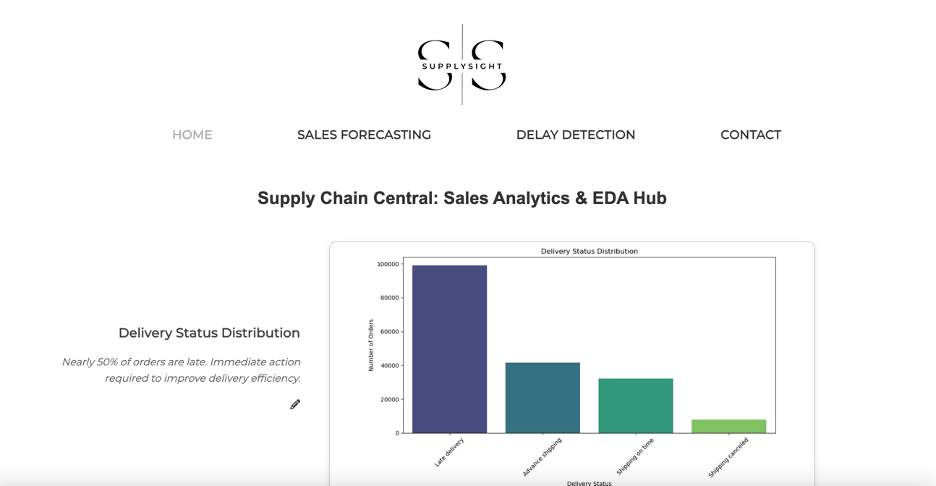

  - **Sales Forecasting**: Users can interact with machine learning models for sales predictions.
    
 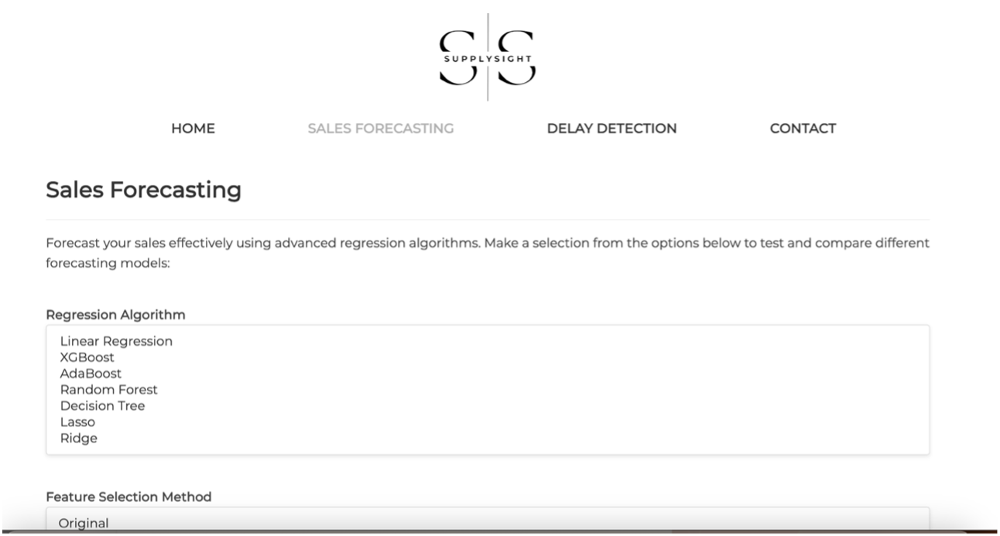

  - **Delay Detection**: Detects late deliveries to optimize logistic.
    
 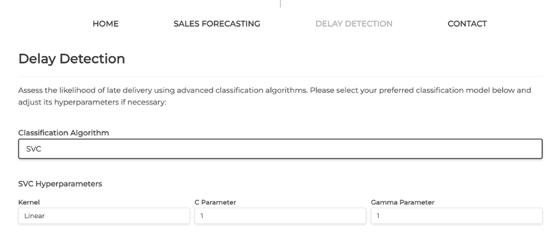

  - **Contact Page**: Provides information and a communication channel.
    
 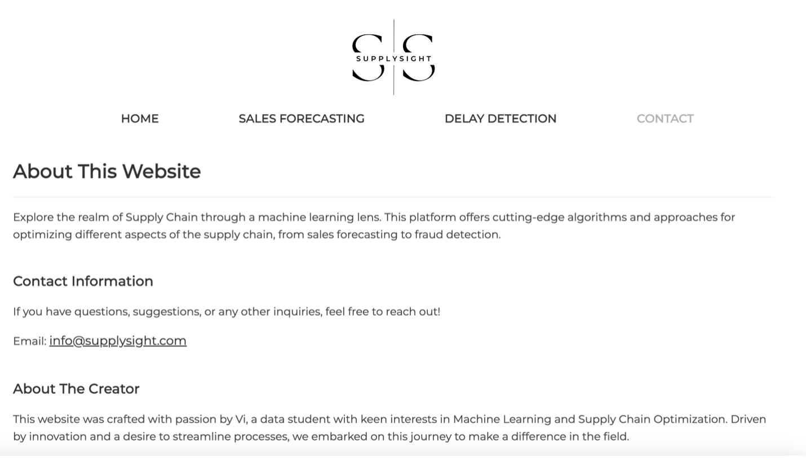

### Back End

- **Flask Framework**: Powers the application's back-end functionalities.
- **Model Execution Route**: Handles POST requests for machine learning predictions.
- **Error Handling**: Robust mechanisms for a smooth user experience.

## Sales Forecasting - Linear Regression Approach

- **Data Processing**: Involves cleaning, dimensionality reduction, and feature creation.
- **Feature Selection**: Uses methods like Variance Threshold and K-Best.
- **Model Execution**: Allows comparison of regression algorithms and feature selections.
 
 

 
 
 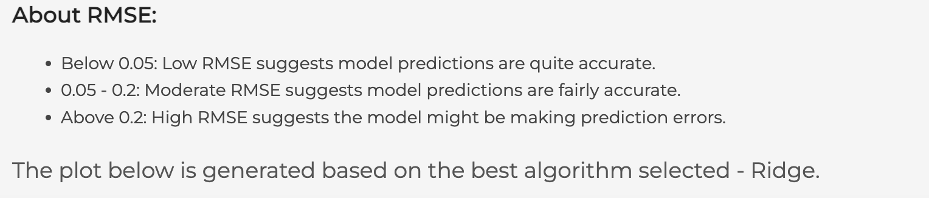

  
 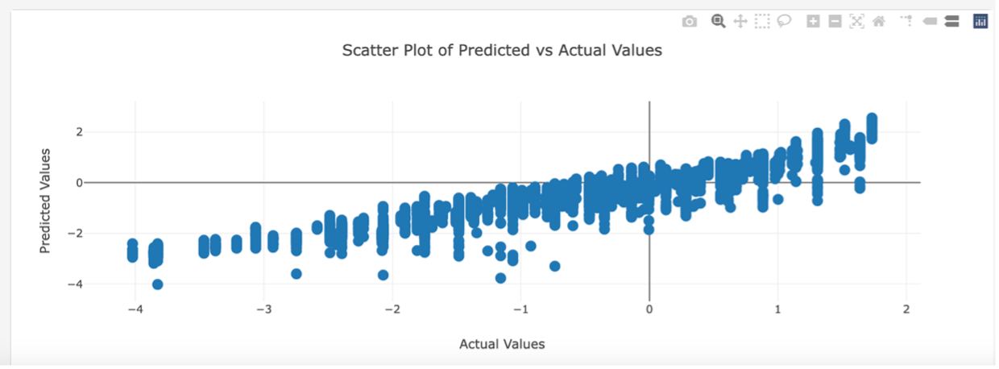

## Delay Detection - Classification Approach

- **Data Transformation**: Includes label encoding and feature selection.
- **Model Execution**: Supports various classifiers with hyperparameter customization.
  
 
 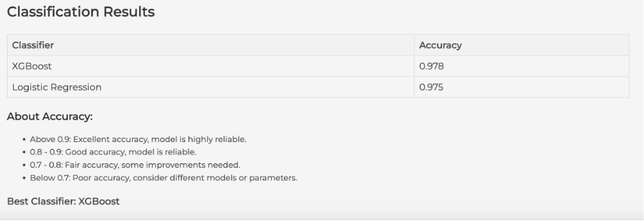

 
 
 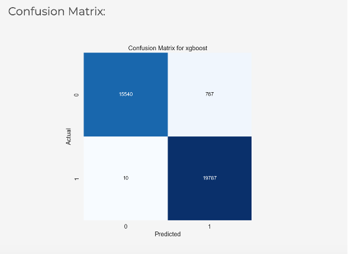

 
 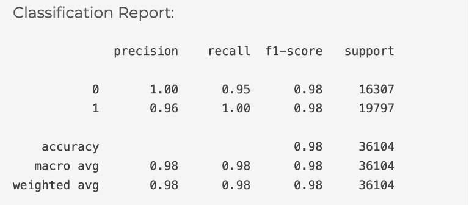

  
## Dashboard - Supply Chain Performance Visualization

- **Visualization Generation**: Utilizes Matplotlib and Seaborn for dynamic charts and graphs.
- **Interactive Features**: Allows real-time editing and updating of analysis text.

 
 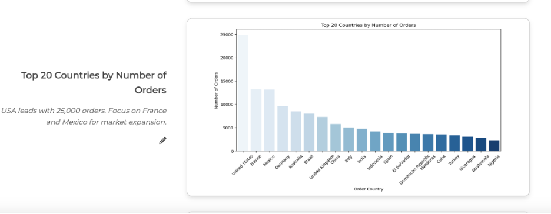

 
 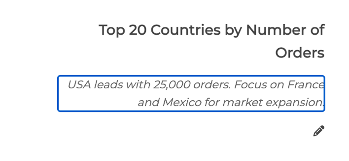

## Lessons Learned and Future Work

- **Full-Stack Development Experience**: Enhanced skills in JavaScript, CSS, HTML, and machine learning integration.
- **Flask Integration and Debugging**: Learned integration of various technologies into a cohesive application.
- **Future Work**: Plans include deployment options and feature expansion like fraud detection.

## Conclusion

This project demonstrates the integration of machine learning in supply chain management, emphasizing data-driven decision-making and efficiency. It stands as a testament to the power of combining different technologies and continuous learning in the tech and data science fields.
